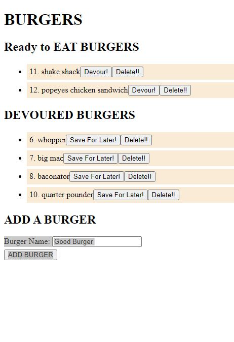
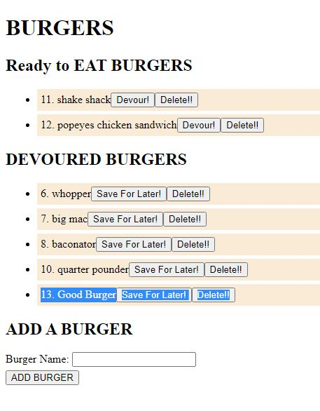
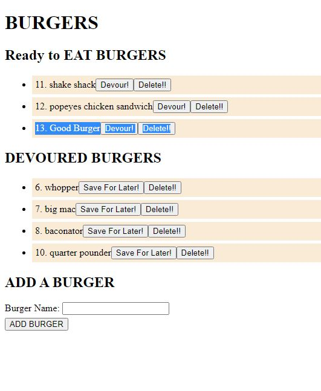

# EAT-DA-BURGER USAGE
Eat-Da-Burger! is a restaurant app that lets users input the names of burgers they'd like to eat.
Whenever a user submits a burger's name, your app will display the burger on the top of the page under ready to eat area -- waiting to be devoured.
Each burger in the ready to eat area also has a Devour button. When the user clicks it, the burger will move to the bottom of the page under devoured burgers.
Each burger on the will have a Delete Button. When the user clicks delete, it will be removed from the db and the page.

## Usage / Directions
---
1. Click the link to fire up app ==> https://immense-waters-93242.herokuapp.com/
2. Enjoy! Yummy!

* Add Burger
    

* Devour Burger
    
    
    
* Ready to Eat 
    

## Tools Used / Dependancies
---
* node.js
* mysql workbench
* express
* jaws_db
* Heroku 
* Github 
* images 

## Links 
---
* https://immense-waters-93242.herokuapp.com/
* https://github.com/brc9087/Eat-Da-BurgerHW
